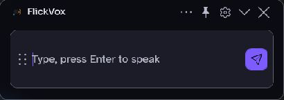

<div align="center">
  
  <h1>FlickVox</h1>
  <p>A lightweight Windows text-to-speech companion powered by Piper.</p>
  <p><strong>Ctrl+Alt+T → Type → Enter → Speak in the background.</strong></p>
  <p><a href="https://github.com/10ishk/FlickVox/releases"><strong>Download from GitHub Releases</strong></a></p>
</div>

FlickVox is a .NET 10 WPF application with a unified quick pill and expanded workspace. Speech runs locally after Piper and a voice model have been downloaded. The current draft, playback controls and saved phrases stay available as you switch modes.



## Features

- Global quick-pill hotkey, immediate hide on submission when enabled, and background speech. Reopen the pill to Stop; FlickVox does not forcibly restore focus to another app.
- Minimal first-run composer and **Set up voices** prompt. After successful speech, an overflow menu unlocks voice preview, speed, output routing, saved phrases, recent messages and Repeat.
- Six configured US English Piper voices: **Ryan Low, Medium, High** and **Lessac Low, Medium, High**. Voice Manager downloads model/configuration pairs on request; voices are not bundled.
- Saved phrases with edit/delete and `Alt+1`–`Alt+9` shortcuts; locally stored recent messages; cached Repeat of the last utterance.
- Eight named themes—Midnight Violet, Signal Green, Ember, Ocean, Neon Rose, Paper, Blush Pink and High Contrast—plus System mode, keyboard focus indicators and reduced-motion support.
- Output-device selection for local speakers or an already installed virtual audio device, plus a tray menu for opening, stopping, repeating, Settings and Exit.

## Download and first run

The preview package targets **Windows x64** and is self-contained; the .NET desktop runtime need not be installed separately. Download `FlickVox-v0.1.0-win-x64.zip` from [GitHub Releases](https://github.com/10ishk/FlickVox/releases), check its accompanying SHA-256 file, extract the entire ZIP into a folder you control, and run `FlickVox.exe` from that folder. Keep the extracted files together. There is no separately verified installer in this preview.

On first run, choose **Set up voices**. FlickVox downloads the compatible Piper runtime from its official release and lets you install a voice in Voice Manager. An internet connection is needed for those downloads, but synthesis and playback operate offline afterward. Settings, history, phrases and downloaded voice/runtime files are stored under `%LOCALAPPDATA%\FlickVox`; they are not part of the ZIP. The app is unsigned—Windows may warn about an unknown publisher. Do not bypass a security block you do not trust.

## Gaming and Discord routing

Press `Ctrl+Alt+T`, type and press Enter. With **Hide quick pill** enabled, the pill hides immediately while Piper generates and plays the message. Press the hotkey again to reopen Stop. In an exclusive-fullscreen game or where another app owns the shortcut, visibility and focus can vary; test your actual setup.

For Discord or another voice-chat app, select an **existing virtual audio output** in FlickVox and select its paired input as your microphone in the chat app. FlickVox does not install a virtual device or change Windows audio defaults. Choosing ordinary speakers plays locally; it does not feed a microphone.

## Keyboard shortcuts

| Shortcut | Action |
|---|---|
| `Ctrl+Alt+T` | Summon the quick pill (default configurable global hotkey) |
| `Enter` | Speak composer text |
| `Shift+Enter` | Insert a newline |
| `Esc` | Close overflow, Stop, or hide the window, in that order |
| `Ctrl+E` | Toggle quick and expanded modes |
| `Ctrl+S` | Save current phrase |
| `Ctrl+R` | Repeat last message |
| `Ctrl+L` | Clear composer |
| `Alt+1`–`Alt+9` | Speak one of the first nine saved phrases |

Only the configured summon hotkey is global; other shortcuts require FlickVox keyboard focus. The quick-pill drag grip also expands on double-click.

## Build from source

Install the .NET 10 SDK on Windows x64, clone this repository, then run:

```powershell
dotnet publish src/FlickVox/FlickVox.csproj -c Release -r win-x64 --self-contained true -o src/FlickVox/bin/Release/publish
```

Run `src/FlickVox/bin/Release/publish/FlickVox.exe`. The source-only `scripts/Install-FlickVox.ps1` is not included in the preview ZIP and has not been validated as a standalone installer. For isolated development checks, set `FLICKVOX_DATA_ROOT` for the FlickVox process to a temporary directory; without it, the normal per-user path above is used.

## Known limitations

- Only the six listed US English voice models are configured. Model downloads require connectivity; voice-model redistribution licenses differ, so models are not packaged.
- Virtual audio routing depends on third-party devices. Audible output, game-specific overlay behavior, exclusive-fullscreen visibility, and every hardware/DPI combination have not been exhaustively verified.
- The binary is unsigned. Pinned taskbar icon changes may be delayed by Windows icon caching.

## License and acknowledgements

FlickVox is [MIT licensed](LICENSE), created and maintained by [10ishk](https://github.com/10ishk). Speech synthesis is powered by [Piper](https://github.com/rhasspy/piper); playback uses [NAudio](https://github.com/naudio/NAudio). Font and Fluent icon licenses, runtime details and model-license cautions are in [third-party notices](THIRD_PARTY_NOTICES.md).
